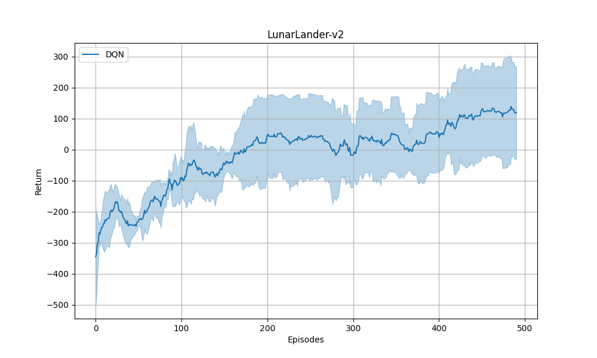
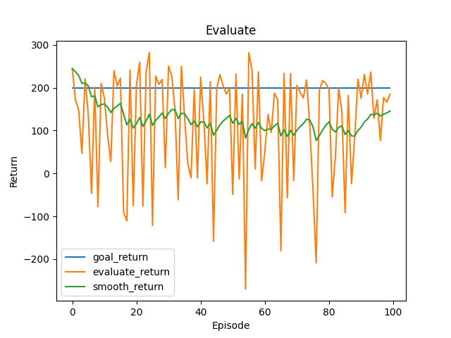

## 参考
* [动手学强化学习](https://hrl.boyuai.com/)
* [elegentRL](https://github.com/AI4Finance-Foundation/ElegantRL)
* [DRL-code-pytorch](https://github.com/Lizhi-sjtu/DRL-code-pytorch)
* [easy-rl](https://github.com/datawhalechina/easy-rl/blob/master/notebooks/DQN.ipynb)
* [maddpg-pettingzoo-pytorch](https://github.com/Git-123-Hub/maddpg-pettingzoo-pytorch)
* [深度强化学习](https://github.com/DeepRLChinese/DeepRL-Chinese/blob/master/04_dqn.py)
* [reinforcement-learning-algorithm](https://github.com/Git-123-Hub/reinforcement-learning-algorithm)
* [DRL-Pytorch](https://github.com/XinJingHao/DRL-Pytorch/)
* [cleanRL](https://github.com/vwxyzjn/cleanrl)

目的是写出像TD3作者那样简单易懂的DRL代码,  
由于参考了ElegentRL和Easy的库,from easy to elegent 故起名为freeRL,  
free也是希望写出的代码可以随意的,自由的从此代码移植到自己的代码上。  
库的介绍：[【FreeRL】我的深度学习库构建思想](https://blog.csdn.net/weixin_56760882/article/details/142176797)


## python环境
```python
python 3.11.9
torch 2.3.1+cu121
gymnasium[all] 0.29.1
pygame 0.25.2 # 这个版本和gymnasium[all]0.29.1兼容
```
## 效果
用DQN算法在LunarLander-v2环境下训练500个轮次的3个seed的效果：线为均值，阴影为方差

用 seed = 0 训练的模型评估,评估100个不同的seed的结果

随机选择其中一个seed的结果，渲染环境


## 显示训练
训练时，使用tensorboard来显示实时的学习曲率。

在DQN_file（算法）文件夹下，D:FreeRL/DQN_file 终端里输入：
tensorboard --logdir=results/env_name
在跳出的http://localhost:6008/ 按住ctrl点击进入就行。

tensorboard保存的文件events.out.tfevents.和模型的位置一致。

## 已实现
* DQN 1.DQN 
2.DQN_Double
3.DQN_Dueling
4.DQN_PER
5.DQN_Noisy
6.DQN_N_Step
7.DQN_Categorical
8.DQN_Rainbow


* DDPG
* PPO